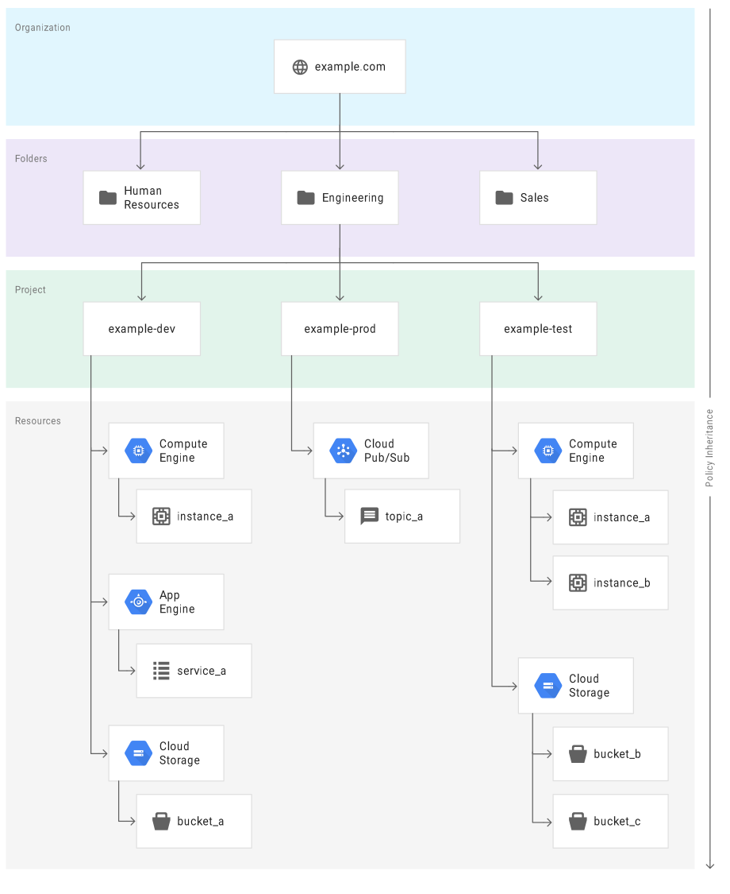

# Cloud Indetity & Access Management

GCP offers Cloud IAM, which lets you manage access control by defining _who_ (identity) has _what access_ (role) for _which_ resource. See full docs [here](https://cloud.google.com/iam/docs/).

## Identity

In Cloud IAM, you can grant access to __members__, which can be of the following types:

* Google account - account of user
* Service account - account of service
* Google group - account of group, no credentials to login
* G Suite domain - like group
* Cloud Identity domain - like GSuite but no access to GSuite
* allAuthenticatedUsers
* allUsers

## Access Management

When an authenticated memeber attempts to make a request, Cloud IAM makes an authorization decision about whether the member is allowed to perform the operation on a resource.

### Resource

Access can be granted to users on GCP resources, e.g. projects, Compute Engine instances, Cloud Storage buckets, etc.

### Permissions

Permissions determin what operations are allowed on a resource. In the CLoud IAM world, permission are represented in the form of `<service>.<resource>.<verb>`, for example, `pubsub.subscriptions.consume`.

Permission is __NOT__ assigned to users directly. Instead, you assign them a __Role__ which contains one or more permissions.

### Roles

A role is a collection of permissions. You cannot assign a permission to the user directly; instead you grant them a role.

There three kinds of roles in Cloud IAM:

1. Primitive roles: **Owner**, **Editor**, and **Viewer**. Historically available in GCP and will continue to work. (**P.S. Billing Administrator**)
2. Predefined roles: Predefined roles are the Cloud IAM roles that give finer-grained access control than the primitive roles. For example, the predefined role **Pub/Sub Publisher** (roles/pubsub.publisher) provides access to only publish messages to a Cloud Pub/Sub topic.
3. Custom roles: Roles that you create to tailor permissions to the needs of your organization when predefined roles don't meet your needs.

### IAM Policy

A _Cloud IAM Policy_ is used to grant roles to users, which is a collection of statements that define who has what type of access. A policy is attached to a **resource** and is used to enforce access control whenever that resource is accessed.

A Cloud IAM policy is represented by the IAM Policy object. An IAM Policy object consists of a list of **bindings**. A Binding binds a list of _members_ to a _role_.

Role is the role you want to asssign to the member. The role is specified in the form of `roles/<NAME_OF_ROLE>`.

Member congains a list of one or more identities as described in the [concepts related to identity](##Identity) section above. Each member type is identified with a prefix, such as Google identity domain(`domain:`). In the example snippet below, the `storage.objectAdmin` role is assigned to the following memebers using the appropriate prefix: `user: alice@example.com`, `serviceAccount:my-other-app@appspot.gserviceaccount.com`, `group:admins@example.com`, and `domain:google.com`. The `objViewer` role is assigned to `user:bob@example`.

The following code snippet shows the structure of a Cloud IAM policy

```json
{
  "bindings": [
   {
     "role": "roles/storage.objectAdmin",
     "members": [
       "user:alice@example.com",
       "serviceAccount:my-other-app@appspot.gserviceaccount.com",
       "group:admins@example.com",
       "domain:google.com" 
     ]
   },
   {
     "role": "roles/storage.objectViewer",
     "members": ["user:bob@example.com"]
   }
   ]
}
```

### Cloud IAM and Policy APIs

Cloud IAM provides a set of methods that you can use to create and manage access control policies on GCP resources. These methods are exposed by the services that support Cloud IAM. For example, the Cloud IAM methods are exposed by the Resource Manager, Cloud Pub/Sub, and Cloud Genomics APIs, etc.

The methods are:

* `setIamPolicy()`: Allows you to set policies on your resources.
* `getIamPolicy()`: Alllows you to get a policy that was previously set.
* `testIamPermissions()`: Allows you to test whether the caller has the specified permissions for a resource.

### Policy Hierarchy

GCP resources are organized hierarchically, there the organization node is the root node in the hierarchy, the projects are the children of the organization, and other resources are the descendants of projects. Each resource has **exactly one** parent. 

For example,  For more detailed documentation, you can go to [Resource Manager Resource Hierarchy](https://cloud.google.com/resource-manager/docs/cloud-platform-resource-hierarchy).

You can set a Cloud IAM policy at any level in the resource hierarchy: the organization level, the folder level, the project level, or the resource level. Resources inherit the policies of the parent resource. The effective policy for a resource is the **union** of the policy set at that resource and the policy inherited from higher up in the hierarchy. 

This policy inheritance is transitive; in other words, resources inherit policies from project, folder, organizatiib. Therefore, the organization-level policies also apply at the resource level.

The Cloud IAM policy hierarchy follows the same path as the GCP resource hierarchy. If you change the resource hierrchy, the policy hierarchy changes as well.

Child policies cannot restrict access granted at a higher level. For example, if you grant the Editor role to a user for a project, and grant the Viewer role to the same user for a child resource, then the user still has the Editor role grant for the child resource.